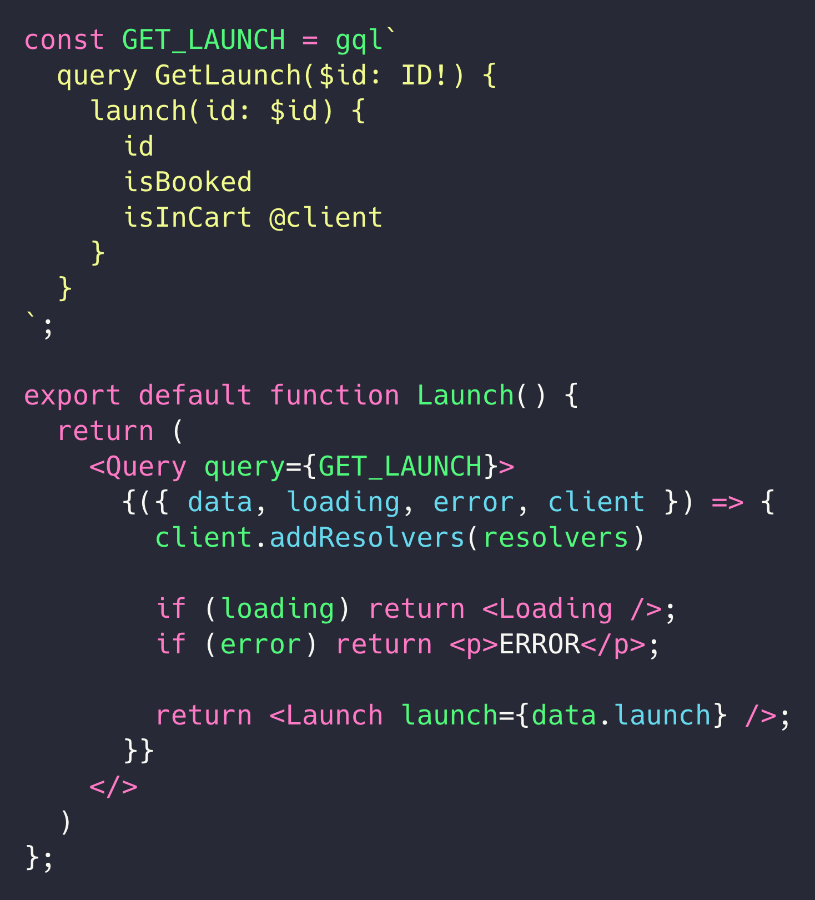

import { Head, Appear, Image } from 'mdx-deck'
import { Split, SplitRight } from 'mdx-deck/layouts'

import { FullScreenBackground, Title, Quote, FullScreen } from './components'
import { colors, fontSize } from './theme'
export { default as theme } from './theme'

<Head>
  <title>What's next for Apollo Client by @peggyrayzis (GraphQL Summit 2018)</title>
  <link href="https://fonts.googleapis.com/css?family=Heebo:300,800" rel="stylesheet"/>
  <link rel="shortcut icon" href="favicon.ico"/>
</Head>

<FullScreenBackground src="./img/background.jpg">
  <div style={{display: 'flex', flexDirection: 'column', alignItems: 'center'}}>
    <h1 style={{fontSize: '4.5em', color: colors.lightBlue, margin: 0, letterSpacing: '2px', textShadow: '3px 3px grey'}}>{`What's next for`}</h1>
    <h1 style={{fontSize: '4.5em', color: colors.white, margin: 0, letterSpacing: '2px', textShadow: '3px 3px grey'}}>{`Apollo Client 🚀`}</h1>
    <h1 style={{fontSize: '2em', color: colors.lightBlue, margin: 0, letterSpacing: '2px', textShadow: '3px 3px grey'}}>{`@peggyrayzis`}</h1>
  </div>
</FullScreenBackground>

---

<FullScreenBackground src="./img/skrillex.png">
  <Appear><Title>If you love GraphQL,<br/>let me hear you scream!</Title></Appear>
</FullScreenBackground>

```notes
- name some performers: Lady Gaga, Skrillex, Wu-Tang Clan
```

---

export default Split


# Hi, I'm Peggy! 👋

## Engineering Manager

## @peggyrayzis

---

<FullScreenBackground src="./img/background.jpg">
  <div style={{display: 'flex', flexDirection: 'column', alignItems: 'center'}}>
    
    <h1 style={{color: colors.white, fontSize: fontSize.medium, textShadow: '3px 3px grey'}}>Our mission: Help developers succeed<br/>building apps with GraphQL 🚀</h1>
  </div>
</FullScreenBackground>

```notes
- my priority is to make sure that all of you in this room are successful with GraphQL
- so everything we build - from our open source libraries to our cloud service - is designed to help developers ship better apps to production faster
```

---

<FullScreenBackground src="./img/npm-stats.png">
  <h1 style={{color: colors.black, fontSize: fontSize.large}}>
    Apollo has grown over 400%<br/>in the past year.
  </h1>
</FullScreenBackground>

```notes
- i think that mission has resonated with developers because apollo has grown over 400% in the past year
- it's been incredible to see apollo client take off this year and we're reaching nearly half a million downloads per week
- i don't think this is an accident - it's not because graphql and apollo are trendy, it's because it solves real world problems that react developers face every single day and i think you all could attest to this
```

---

# State management is hard


```notes
- one of the problems we face as react developers is how to manage state in our applications.
- first we have to pick a state management library with the most popular being redux. then we have to worry about choosing the right middleware, asynchronous action creators, data normalization, and selectors.
- on top of that, we have to execute complicated features like pagination and optimistic ui
```

---

# Apollo removes complexity


```notes
- apollo removes a significant amount of that complexity for us thanks to its intelligent cache and network stack
- instead of writing thousands of lines of redux boilerplate, all we have to do is write queries and bind them to our UI with a query components
- apollo client will take care of the rest
```

---

<FullScreenBackground src="./img/npm-stats.png">
  <h1 style={{color: colors.black, fontSize: fontSize.large}}>
    30% of Apollo Client<br/>
    users are also using<br/>Apollo Link State.
  </h1>
</FullScreenBackground>

```notes
- typically, when people think of apollo client they're thinking of data from a remote server.
- but over the past year, more and more developers are starting to manage their local state with apollo too.
- in fact, 30% of apollo client users are using apollo link state to manage their local data.
```

---

# It started off as an idea:


```notes
- it's amazing to think that apollo link state started off as an experimental idea that was previewed on the graphql summit stage one year ago 
- this idea resonated with developers because it's an elegant programming model and it solves a real need, which is why:
```

---

# Today, these companies are managing their local state with Apollo:

<div style={{display: 'flex', flexDirection: 'row', alignItems: 'center', alignSelf: 'center', justifyContent: 'space-around', marginTop: '80px'}}>
  
  
  
  
  
</div>

```notes
- companies like netflix, airbnb, and hilton are all using apollo client to manage their local data with apollo link state in production
- what caused this to happen? why did this idea take off so quickly
```

---

# One source of truth


```notes
- developers want one source of truth when managing their data. one of the most compelling benefits is that apollo client can handle all types of data
- from graph APIs to local data, and even data from legacy REST APIs, apollo can hold all of it without the need for a separate mobx or redux store
- having one source of truth reduces complexity and mental overhead
```

---

# One interface for your data


```notes
- another reason why managing local data with apollo is so revolutionary is that graphql becomes a unified interface to all of your app's data
- our components are usually made up of lots of different types of data
- with graphql, we can query all of that data in exactly the same way and simply pass it down to our component
```

---

# Promise of excellent tooling*


```notes
- finally, i think the early adopters of managing local state with apollo were sold on the promise of bringing the excellent tooling we have on the server over to the client
- if we can leverage graphql's static typing and the concept of a client schema, we can enjoy the same features like autocomplete and jump to schema definitions that we experience when we write queries for remote data
- when we launched apollo link state, this was just a promise however. we had an early version working of devtools that would stitch your client schema and remote schema together in graphiql
- but all of this excellent tooling wasn't 100% there yet.
- for the last 6 months, we've been committed to making this happen however
```

---

<FullScreenBackground src="./img/iss.jpg">
  <h1 style={{color: colors.black, fontSize: fontSize.large}}>Apollo helps developers by<br/>lowering the barrier to<br/>building great apps.</h1>
</FullScreenBackground>

```notes
- with one source of truth for all the data in your app, one unified interface for querying local and remote data with graphql, and excellent tooling, apollo helps react developers by eliminating barriers to building great data-driven apps
- at apollo, we're truly invested in making sure all developers can benefit from our software.
```

---

<Quote
  quote="I'm a new frontend developer and our team at code school decided to learn GraphQL and deploy an app using Apollo in 2 weeks for our final project."
  author="Chad Whitaker (@tchadwhitaker), Momentum Learning"
/>

```notes
- recently i asked a question on twitter asking if any bootcamp students or developers new to programming had used apollo before and i was absolutely amazed by the responses
- so many new developers had chosen apollo because it simplified state management in their apps, and they were able to pick it up in only two weeks
- i think this is a testament to how straight forward data management becomes when you build your app with apollo
```

---

<Quote
  quote="Once you move to Apollo to handle data over the network, it becomes much harder to justify loading a library like Redux for local state management. Apollo fills that need perfectly."
  author="Adam Neary (@AdamRNeary), Airbnb"
/>

```notes
- apollo isn't just for developers starting out, however. although we pride ourselves on a great getting started experience, we also want to make sure our software scales for large engineering organizations
- as you heard in adam's talk earlier this morning, airbnb uses apollo client to manage their remote graph api data, their local data, and their legacy rest data all in a single request
- since they've switched some apps to apollo, they haven't needed to load redux
```

---

# React developers want an opinionated way to manage data in their apps.

```notes
- so what we've learned from speaking with developers is whether you're new to programming or you work on a large team, everyone wants a straightforward, opinionated way to manage data in their apps
- they don't want to write a ton of boilerplate or synchronize data between multiple stores
- they just want to specify their data requirements and have it show up on the page and apollo fills that need perfectly
- all of these learnings are what have influenced our plan for the next version of apollo client, which is why we're so excited to announce
```

---

<FullScreenBackground src="./img/moon.jpg">
  <div style={{display: 'flex', flexDirection: 'column'}}>
    <h1 style={{fontSize: '4.5em', color: colors.white, margin: 0, letterSpacing: '2px', textShadow: '3px 3px grey'}}>{`Apollo Client 2.5`}</h1>
    <h1 style={{fontSize: '2em', color: colors.black, margin: 0, letterSpacing: '2px'}}>{`npm install apollo-client@alpha`}</h1>
  </div>
</FullScreenBackground>

```notes
- the alpha of apollo client 2.5! we have a lot of awesome features to show you and the best part is that you can try it out today by installing the alpha
```

---

<FullScreenBackground src="./img/moon.jpg">
  <h1 style={{fontSize: '4.5em', color: colors.white, margin: 0, letterSpacing: '2px', textShadow: '3px 3px grey'}}>We're merging<br/>Apollo Link State<br/>into core! 🎉</h1>
</FullScreenBackground>

---

export default Split


# Define your data model with client schemas

---

# One familiar programming model across client & server


---

export default Split



# Dynamically add resolvers for code-splitting

---

# More new features:

- Support for local subscriptions
- @export local fields as variables for server data
- Async cache initializers for local & remote data

---

export default Split


<div>
  <h1 style={{color: colors.lightBlue, fontSize: fontSize.medium}}>
    We improved Apollo<br/>cache performance<br/>by 2x on average.
  </h1>
  <h2 style={{fontWeight: '400'}}>To learn more, don't miss:<br/>Apollo Client Caching in Depth<br/>Ben Newman (@benjamn)<br/>11/8 at 3pm in the Lodge</h2>
</div>

---

<FullScreenBackground src="./img/galaxy.jpg">
  <h1 style={{fontSize: fontSize.large, color: colors.white, margin: 0, letterSpacing: '2px', textShadow: '3px 3px grey'}}>
    Excellent tooling is what the<br/>Apollo developer experience<br/>is all about.
  </h1>
</FullScreenBackground>

---

<FullScreenBackground src="./img/galaxy.jpg">
  <div style={{display: 'flex', flexDirection: 'column'}}>
    <h1 style={{fontSize: '4.5em', color: colors.white, margin: 0, letterSpacing: '2px', textShadow: '3px 3px grey'}}>
      Apollo VSCode
    </h1>
    <h2 style={{color: colors.white, margin: 0, fontWeight: '400', fontSize: fontSize.medium}}>
      Now available in the Extension Marketplace!
    </h2>
  </div>
</FullScreenBackground>

---

<video src="./img/vscode-trimmed.mp4" width="100%" height="100%" controls autoPlay muted />

---

# Apollo VSCode

- Autocomplete as you're writing queries
- Inline tracing metrics from Engine
- Deprecation warnings
- Switch between schema tags
- Peek schema definitions

---

<video src="./img/local-state.mov" width="100%" height="100%" controls autoPlay muted />

---

# Apollo VSCode

- Connects to client schema
- Warns against incorrectly extending types
- Autocomplete for local queries
- Peek client schema definitions
- Peek fragment definitions and docstrings

---

<FullScreenBackground src="./img/galaxy.jpg">
  <div style={{display: 'flex', flexDirection: 'column'}}>
    <h1 style={{fontSize: '4.5em', color: colors.white, margin: 0, letterSpacing: '2px', textShadow: '3px 3px grey'}}>
      Apollo CLI
    </h1>
    <h2 style={{color: colors.white, margin: 0, fontWeight: '400', fontSize: fontSize.medium}}>
      TypeScript definitions for client schemas
    </h2>
  </div>
</FullScreenBackground>

---

# We want you to learn state<br/>management with Apollo<br/>the right way.

---

export default Split


# Apollo tutorial 📚

- Learn the Apollo platform by building and deploying a real-world app
- Includes pagination, authentication, local state management, and more!

---

<FullScreenBackground src="./img/moon.jpg">
  <div style={{display: 'flex', flexDirection: 'column'}}>
    <h1 style={{fontSize: '4.5em', color: colors.white, margin: 0, letterSpacing: '2px', textShadow: '3px 3px grey'}}>
      The Apollo tutorial 🚀
    </h1>
    <h2 style={{color: colors.black, margin: 0, fontWeight: '400', fontSize: fontSize.medium}}>
      Available today at apollographql.com/docs!
    </h2>
  </div>
</FullScreenBackground>

---

# What's next?

---

<FullScreenBackground src="./img/iss.jpg">
  <div style={{display: 'flex', flexDirection: 'column'}}>
    <h1 style={{fontSize: '4.5em', color: colors.white, margin: 0, letterSpacing: '2px', textShadow: '3px 3px grey'}}>Apollo Client 3.0</h1>
    <h2 style={{color: colors.black, margin: 0, fontWeight: '400', fontSize: fontSize.medium}}>
      What's on the roadmap?
    </h2>
  </div>
</FullScreenBackground>

---

# #1: Merge Apollo Boost<br/>into client core
## At the same time, reduce bundle size

---

# #2: Cache invalidation
## Cache tags & garbage collection

---

# #3: Modernize<br/>React Apollo API
## Suspense, hooks, and async server rendering

---

# We want your help! 🙏
## https://github.com/apollographql/apollo-feature-requests/

---

<FullScreenBackground src="./img/galaxy.jpg">
  <h1 style={{fontSize: fontSize.large, color: colors.white, margin: 0, letterSpacing: '2px', textShadow: '3px 3px grey'}}>
    We want your<br/>experience using Apollo<br/>to be the best it can be.
  </h1>
</FullScreenBackground>

---

<FullScreenBackground src="./img/galaxy.jpg">
  <div style={{display: 'flex', alignItems: 'center', justifyContent: 'flex-start', alignSelf: 'center'}}>
    
    <div style={{display: 'flex', flexDirection: 'column', alignItems: 'flex-start'}}>
      <h1 style={{fontSize: fontSize.large, color: colors.white, margin: 0, letterSpacing: '2px', textShadow: '3px 3px grey'}}>
        Thank you Summit!
      </h1>
      <h1 style={{fontSize: fontSize.medium, color: colors.lightBlue, margin: 0, letterSpacing: '2px', textShadow: '3px 3px grey'}}>
        @peggyrayzis
      </h1>
    </div>
  </div>
</FullScreenBackground>
